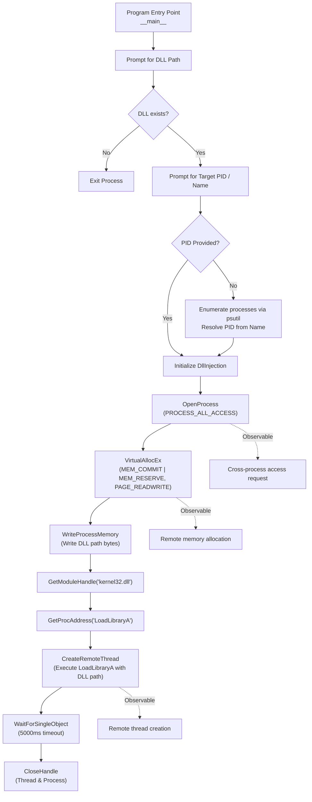

# Python DLL Injector --- Technical Analysis Report

> **Purpose:** Defensive documentation and technical analysis of the supplied Python source code for README.md.
> **Scope:** This document describes behavior that is directly observable in the provided Python source file. It details the mechanisms used to allocate memory and inject dynamic link libraries (DLLs) into running Windows processes.

---

## 1. Executive Summary

The provided Python script is a Windows-based DLL injection tool. It utilizes the `win32` API via the `pywin32` library to force a target process to load an external DLL.

The supplied implementation:

1. Prompts the user for a DLL path.
2. Prompts the user for a target Process ID (PID) or Process Name.
3. Resolves the target process ID using `psutil` if a name is provided.
4. Obtains a handle to the target process with `PROCESS_ALL_ACCESS` permissions.
5. Allocates virtual memory within the target process space.
6. Writes the file path of the specified DLL into the allocated memory.
7. Resolves the memory address of `LoadLibraryA` from `kernel32.dll`.
8. Creates a remote thread in the target process, instructing it to execute `LoadLibraryA` with the allocated DLL path as its argument.
9. Waits for the remote thread to finish execution before closing the handles.

This represents a classic `CreateRemoteThread` injection workflow, commonly used in both legitimate debugging scenarios and malware development.

---

## 2. Analysis Scope

### Source files reviewed

| File | Role |
| --- | --- |
| `injector.py` (assumed) | Main script containing process resolution, memory allocation, and remote thread execution logic. |

The analysis is based exclusively on the supplied Python source code.

---

## 3. Workflow Diagram

---

## 4. Detailed Execution Flow

### 4.1 Target Process Resolution

The script accepts either a direct PID or a process name. If a name is provided, `get_pid()` iterates through running system processes using `psutil.process_iter(["name", "pid"])`.
*(Note: The provided implementation contains structural logic flaws in how it maps `process.parent()` and compares names, but the underlying intent is basic process enumeration).*

### 4.2 Process Access and Memory Allocation

The script calls `win32api.OpenProcess` requesting `PROCESS_ALL_ACCESS`. If successful, it invokes `win32process.VirtualAllocEx` to carve out a memory space in the target process large enough to hold the null-terminated string of the DLL path. The memory is allocated with `PAGE_READWRITE` protections.

### 4.3 Payload Writing and Execution

Using `win32process.WriteProcessMemory`, the script writes the encoded DLL path (`mbcs` + null byte) into the newly allocated memory space.
To trigger the execution, the script dynamically resolves the address of `LoadLibraryA` from the local `kernel32.dll`. Because core Windows DLLs are mapped to the same base address across all processes in a given boot session, this local address is valid in the remote target process.
`win32process.CreateRemoteThread` is then called, passing the address of `LoadLibraryA` as the starting routine, and the address of the written DLL path as the parameter.

---

## 5. Observed Detection / Monitoring Opportunities

The script relies on loud, well-documented Windows APIs that generate distinct telemetry.

### High-value behavioral signals

1. **Remote Memory Allocation:** Calling `VirtualAllocEx` across process boundaries is highly observable by Endpoint Detection and Response (EDR) solutions.
2. **Cross-Process Handle Creation:** Requesting `PROCESS_ALL_ACCESS` rights to another process (especially if the target is a higher-privilege or unrelated system process) will trigger security monitoring.
3. **Remote Thread Creation:** The invocation of `CreateRemoteThread` is a primary telemetry point (e.g., Sysmon Event ID 8).
4. **DLL Load Events:** The target process will generate an image load event (Sysmon Event ID 7) for the injected DLL, which may stand out if the DLL is unsigned or loaded from a suspicious directory.

---

## 6. MITRE ATT&CK Mapping

| Technique | Assessment | Reason |
| --- | --- | --- |
| **T1055 - Process Injection** | Strongly supported | The code explicitly allocates memory and creates a thread in a remote process to execute a payload. |
| **T1106 - Native API** | Strongly supported | The script utilizes native Windows APIs (`OpenProcess`, `VirtualAllocEx`, `WriteProcessMemory`, `CreateRemoteThread`) via Python bindings. |
| **T1057 - Process Discovery** | Supported | The script utilizes `psutil.process_iter` to map process names to identifiers. |

---

## 7. Forensic Artifacts

During an investigation of this execution, the following artifacts would be relevant:

* **Sysmon Event ID 8 (CreateRemoteThread):** Generated when the script executes the remote thread. The event will show the source Python process and the target process.
* **Sysmon Event ID 10 (ProcessAccess):** Generated when `OpenProcess` requests `PROCESS_ALL_ACCESS`.
* **Memory Artifacts:** The target process will contain a readable memory segment containing the file path string of the injected DLL.
* **Command Line Execution:** The Python interpreter's execution context and the console input provided by the user.

---

## Disclaimer

This README.md is intended for authorized malware analysis, system administration, detection engineering, and security research. It documents the behavior present in the supplied source and is structured strictly for defensive analysis and logging purposes.
